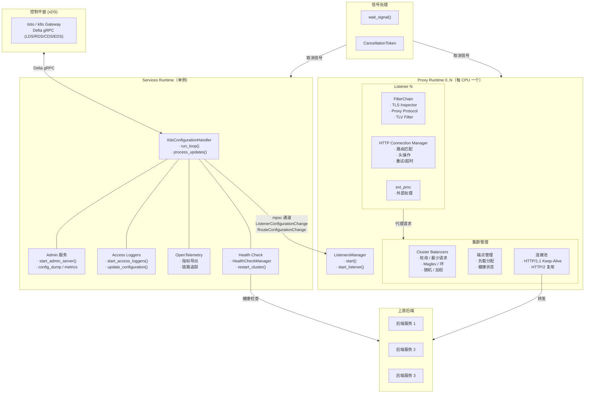

# CLAUDE.md

本文件用于指导 Claude Code（claude.ai/code）在该仓库中进行代码操作。

## 构建与测试命令

```bash
# 构建所有 crate（release 模式，锁定依赖）
cargo build --workspace --release --locked

# 运行所有测试
cargo test --workspace --release --locked

# 运行单个测试用例
cargo test --workspace --release --locked <test_name>

# 运行指定 crate 的测试
cargo test -p orion-lib --release --locked

# 代码检查
cargo clippy --all-targets --all-features

# 代码格式化
cargo fmt --all

# 完整 CI（串行执行，本地开发用）
make ci

# 完整 CI（并行：fmt/lint/build 同时执行，build 成功后跑测试）
make ci-parallel

# 初始化 git 子模块（首次构建前必须执行）
make init

# 构建 Docker 镜像
make docker-build

# 运行代理
cargo run --bin orion -- --config <config-yaml-path>
```

## 架构概览

Orion Proxy 是一个用 Rust 编写、兼容 Envoy xDS API 的 L7 代理。它遵循**无共享**原则：默认情况下为每个 CPU/线程创建一个 Tokio 运行时实例并绑定绑核，最小化跨 CPU 通信。

### Crate 依赖关系（自底向上）

| Crate | 职责 |
|---|---|
| `envoy-data-plane-api` | 从 Envoy xDS protobuf 生成的 Rust 绑定（通过 `prost`/`tonic`），以 git 子模块形式引入 |
| `orion-error` | 共享的 `Error`/`Result` 类型 |
| `orion-http-header` | HTTP 头部解析与操作 |
| `orion-interner` | 字符串驻留，提升性能 |
| `orion-format` | 数据格式化工具 |
| `orion-metrics` | Prometheus 指标采集与分片状态 |
| `orion-tracing` | OpenTelemetry 分布式追踪、链路上下文传播、请求 ID 生成 |
| `orion-configuration` | YAML 配置解析、Envoy protobuf 到内部类型的转换、typed struct 注册 |
| `orion-data-plane-api` | 内部数据平面 API 类型，桥接 Envoy 类型与 Orion 类型 |
| `orion-xds` | xDS delta/gRPC 客户端 —— 从控制平面订阅 LDS、RDS、CDS、EDS |
| `orion-lib` | **核心库** —— 监听器管理、HTTP 连接处理、集群/负载均衡、传输层、请求体处理、访问日志、密钥管理 |
| `orion-proxy` | **主二进制** —— 整合所有模块：运行时启动、管理接口、信号处理、xDS 配置编排 |

### 核心库（`orion-lib`）模块结构

```
src/
├── access_log/        # 异步文件/批处理访问日志，支持延迟初始化
├── body/              # 请求/响应体类型（多态 body、超时、指标包装）
├── clusters/          # 上游集群管理
│   ├── balancers/     # 负载均衡：轮询、最少请求、随机、Maglev、环、加权
│   ├── health/        # 主动健康检查（HTTP、TCP），含失败计数
│   ├── cluster.rs     # 集群状态机 + ClusterType 枚举
│   └── clusters_manager.rs  # 管理所有集群，监听配置变更
├── listeners/         # 下游连接处理
│   ├── http_connection_manager/  # HTTP/1.1、HTTP/2 路由、过滤器、升级、ext_proc
│   ├── filterchain.rs # 监听器过滤器链（TLS 检测、代理协议、TLV）
│   ├── listener.rs    # 单个监听器生命周期管理
│   └── listeners_manager.rs  # 管理所有监听器，应用配置差异
├── transport/         # 网络 I/O
│   ├── connector.rs   # TCP/TLS 连接池与复用
│   ├── resolver.rs    # DNS 解析（hickory-resolver）
│   ├── tls_inspector.rs  # TLS 指纹识别（不终止 TLS）
│   ├── proxy_protocol.rs # HAProxy 代理协议 v1/v2
│   ├── tlv_listener_filter.rs # Kmesh 兼容的 TLV 过滤器
│   └── request_context.rs # 每个请求的传输层状态
├── observability/     # Prometheus 指标端点、OpenTelemetry 导出器
└── secrets/           # 基于 rustls 的 TLS 证书管理
```

### xDS 配置流转

```
控制平面（Istio/k8s Gateway）
    │
    ▼  Delta gRPC（LDS、RDS、CDS、EDS）
orion-xds（client.rs、server.rs、request.rs、model.rs）
    │
    ▼  Channel 更新
orion-proxy（xds_configurator.rs → ProxyConfiguration）
    │
    ▼  ConfigurationSenders（mpsc 通道）
orion-lib（listeners_manager、clusters_manager）
    │
    ▼
应用监听器/集群/路由配置
```

## 运行时架构图

以下为 Orion Proxy 各组件在运行时的交互关系：



## 代码启动流程

以下为 Orion Proxy 从 `main()` 到各运行时启动的完整调用链，标注了关键函数和文件位置：

```
启动阶段
  main()                                                [orion-proxy/src/main.rs]
   └─ run()                                             [orion-proxy/src/lib.rs:33]
        ├─ Options::parse_options()                     解析 CLI 参数
        ├─ Config::new(&options)                        加载 YAML 配置
        ├─ RUNTIME_CONFIG.set(runtime)                  保存运行时配置（全局静态）
        ├─ TracingManager::update(logging)              初始化日志（stdout/文件，热重载）
        ├─ POD_NAME/POD_NAMESPACE 注入 Node             环境变量→bootstrap.node
        └─ run_orion(bootstrap, access_logging)         核心启动入口
                                                [orion-proxy/src/proxy.rs:51]
             ├─ wait_signal()                           注册 SIGINT/SIGTERM
             │     [orion-proxy/src/signal.rs:42]
             │    └─ CancellationToken                  统一关闭信号
             │
             └─ launch_runtimes()                       创建所有运行时
                  [orion-proxy/src/proxy.rs:109]
                    │
                    ├─ calculate_num_threads_per_runtime()  计算每运行时的线程数
                    ├─ build_tokio_runtime()                创建 Tokio 运行时
                    │     [orion-proxy/src/runtime.rs:45]
                    │    └─ core_affinity::set_cores_for_current()   绑核
                    │
                    ├─ Services Runtime (1 个, 单一线程)                  
                    │  └─ run_services(config)             
                    │        [orion-proxy/src/proxy.rs:272]
                    │         ├─ configure_initial_resources_and_spawn_xds_client()
                    │         │     [proxy.rs:330]
                    │         │    ├─ configure_initial_resources()    部署静态 listener/cluster
                    │         │    └─ XdsConfigurationHandler::run_loop()   xDS 主循环
                    │         │          [orion-proxy/src/xds_configurator.rs:114]
                    │         │           └─ process_updates()         处理 LDS/RDS/CDS/EDS
                    │         │                 └─ send_change_to_runtimes()  mpsc 通知各 Proxy RT
                    │         │
                    │         ├─ spawn_admin_service()         Admin HTTP 接口
                    │         ├─ spawn_access_loggers()        访问日志
                    │         ├─ otel_launch_exporter()        指标导出
                    │         └─ otel_update_tracers()         链路追踪
                    │
                    └─ Proxy Runtime (N 个, 每 CPU/线程一个)
                       └─ start_proxy()
                             [orion-proxy/src/proxy.rs:426]
                              └─ ListenersManager::start()    循环监听配置变更
                                    [orion-lib/src/listeners/listeners_manager.rs:75]
                                     └─ Listener::start()     监听端口、接受连接
                                           └─ FilterChain 处理
                                              ├─ TLS Inspector
                                              ├─ Proxy Protocol
                                              ├─ TLV Listener Filter
                                              └─ HTTP Connection Manager
                                                   ├─ 路由匹配
                                                   ├─ 头操作 / 重试 / 超时
                                                   ├─ ext_proc 外部处理
                                                   └─ 负载均衡 → 上游后端
```

## 关键设计决策

- **Clippy 严格模式**：`unwrap_used`/`expect_used` 在工作空间级别被拒绝（测试中允许）。优先使用 `?` 或模式匹配。
- **禁止使用 `tokio::time::timeout`**：应使用 `pingora_timeout::fast_timeout::fast_timeout` 替代（通过 clippy `disallowed-methods` 强制）。
- **Panic/todo**：`panic!` 和 `todo!` 被警告；`unimplemented!` 被拒绝。
- **内存分配器**：默认使用 `aws-lc-rs`（rustls）；可选择 jemalloc 或 dhat 用于堆分析。
- **传输安全**：使用 `rustls`（非 OpenSSL）实现 TLS —— 内存安全的 TLS/mTLS。
- **性能构建配置**：`release`（strip debuginfo、LTO）、`release-debuginfo`（全量调试符号）、`release-dhat`（堆分析）。
- **函数参数限制**：最多 5 个参数（由 clippy `too-many-arguments-threshold` 设置）。

### 测试

- 测试文件分布在内联（`#[cfg(test)] mod tests`）和各 crate 的 `tests/` 目录中
- `orion-configuration/tests/` 包含配置集成测试
- `orion-proxy/tests/configs.rs` 包含端到端代理测试
- `orion-xds/tests/` 和 `orion-data-plane-api/tests/` 包含 xDS/Envoy 验证测试
- 关键测试工具使用 `tracing-test` 在测试中捕获日志
