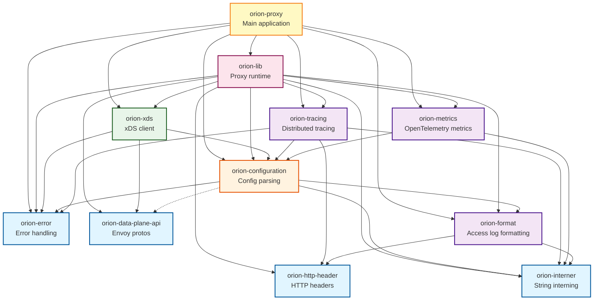
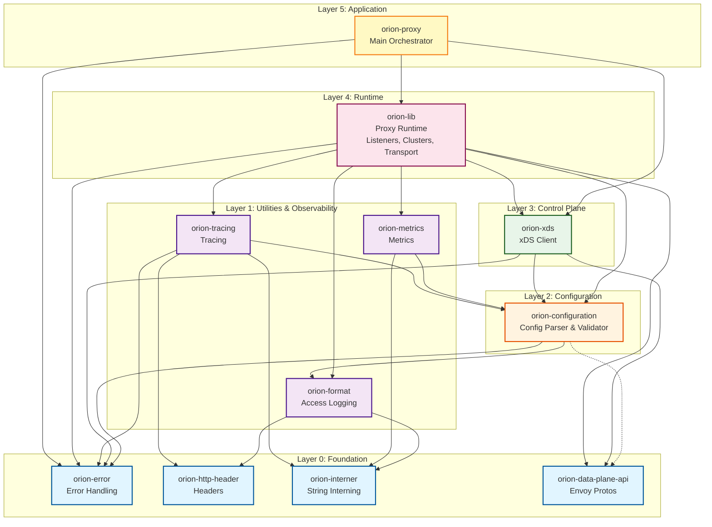
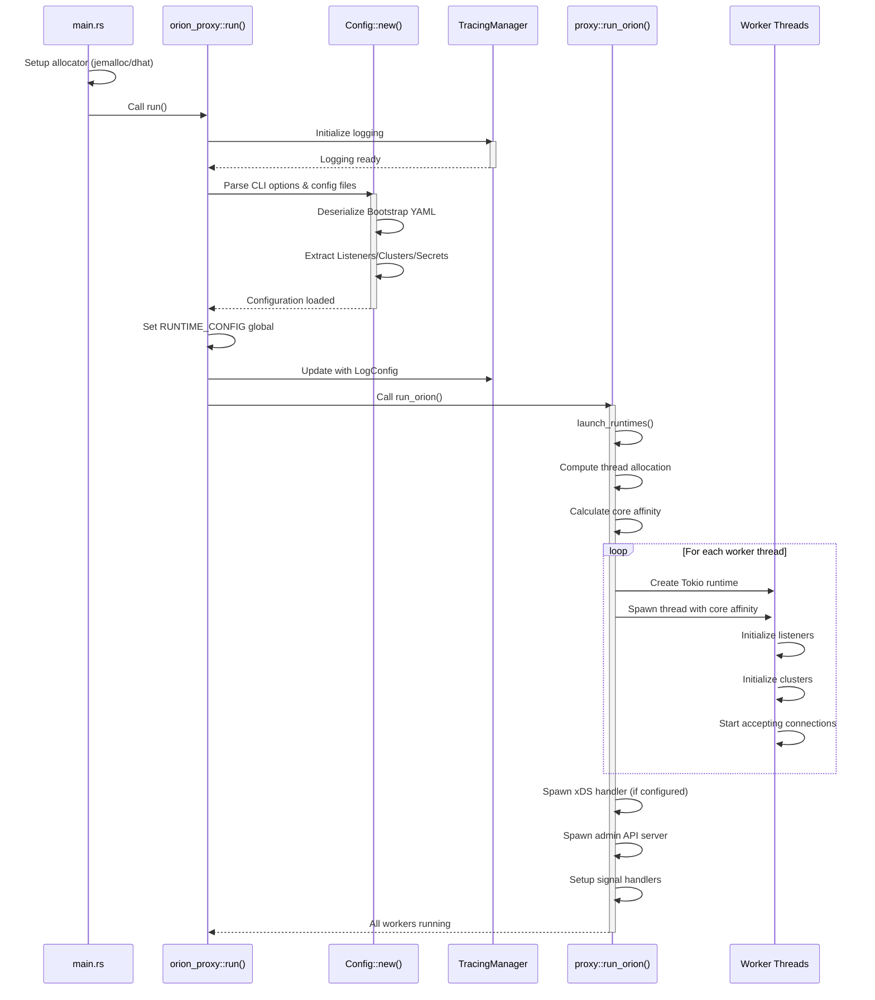
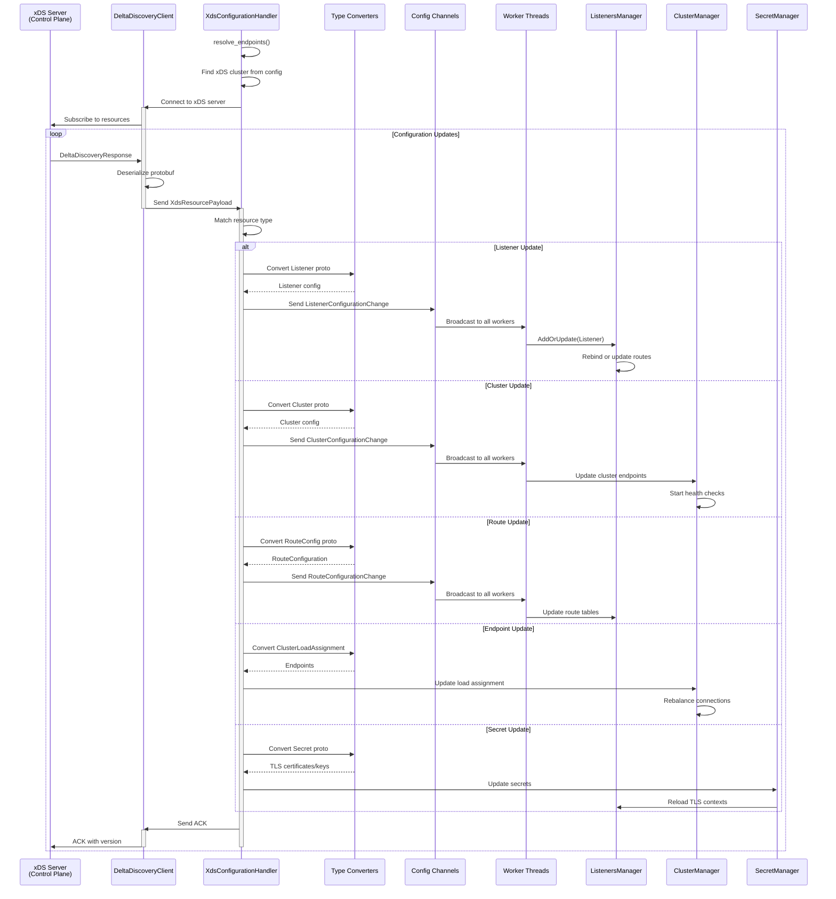
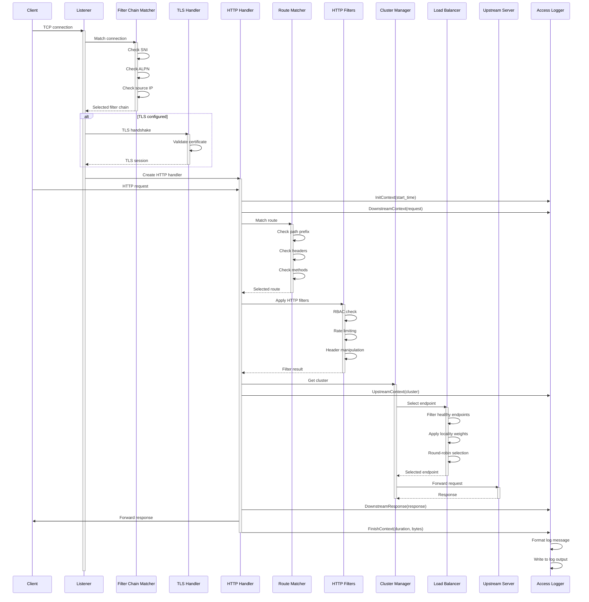
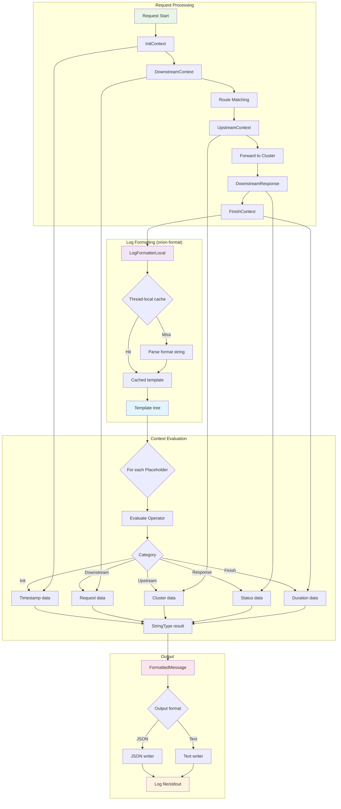
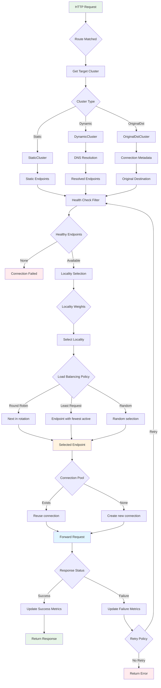
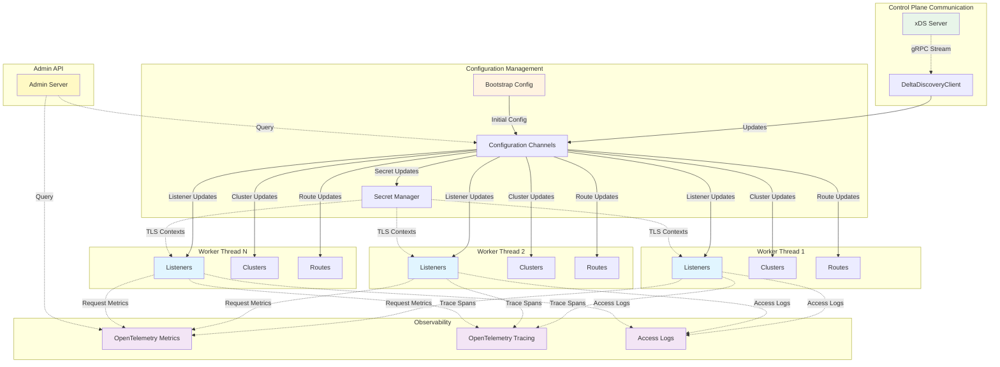
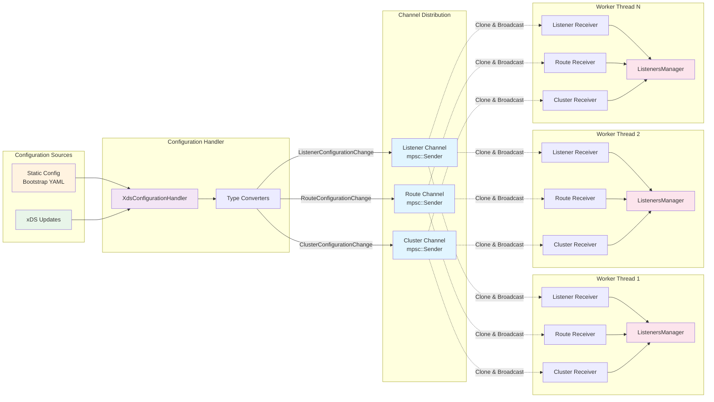
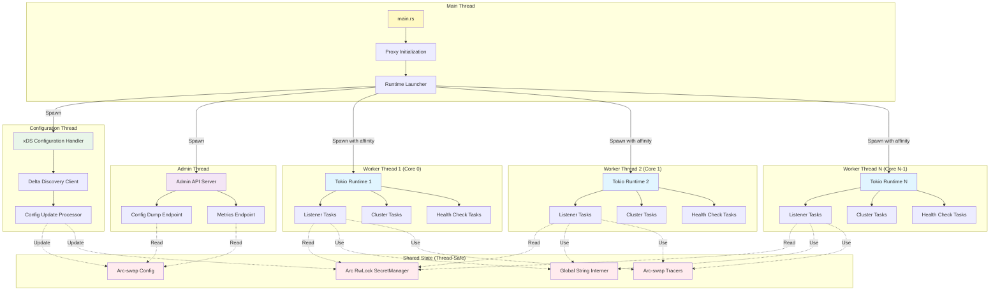

# Orion-Kmesh Architecture Diagrams

This document provides visual representations of the Orion-Kmesh architecture using Mermaid diagrams. These diagrams illustrate the relationships between crates, data flows, and major code interactions.

## Table of Contents

1. [Crate Dependency Graph](#crate-dependency-graph)
2. [Architectural Layers](#architectural-layers)
3. [Application Startup Flow](#application-startup-flow)
4. [xDS Configuration Update Flow](#xds-configuration-update-flow)
5. [Request Processing Flow](#request-processing-flow)
6. [Access Logging Flow](#access-logging-flow)
7. [Cluster Selection & Load Balancing](#cluster-selection--load-balancing)
8. [Component Interaction Overview](#component-interaction-overview)
9. [Configuration Channel Architecture](#configuration-channel-architecture)
10. [Thread Architecture](#thread-architecture)

## Crate Dependency Graph

This diagram shows the dependencies between all orion-* crates.

## Architectural Layers

This diagram shows the layered architecture of Orion-Kmesh.

## Application Startup Flow

This diagram illustrates the initialization sequence when the proxy starts.

## xDS Configuration Update Flow

This diagram shows how dynamic configuration updates flow through the system.

## Request Processing Flow

This diagram shows the complete lifecycle of an HTTP request through the proxy.

## Access Logging Flow

This diagram details how access logs are generated and formatted.

## Cluster Selection & Load Balancing

This diagram shows the cluster selection and load balancing process.

## Component Interaction Overview

This high-level diagram shows how major components interact during runtime.

## Configuration Channel Architecture

This diagram shows the async channel architecture for configuration distribution.

## Thread Architecture

This diagram illustrates the multi-threaded runtime architecture.

## Summary

These diagrams provide a comprehensive visual representation of the Orion-Kmesh architecture:

1. **Dependency graphs** show the modular structure and crate relationships
2. **Flow diagrams** illustrate the sequence of operations for key scenarios
3. **Component diagrams** demonstrate runtime interactions and data flow
4. **Architecture diagrams** reveal the thread model and shared state management

Together with the [architecture documentation](./architecture.md), these diagrams provide a complete picture of how Orion-Kmesh is structured and operates.
